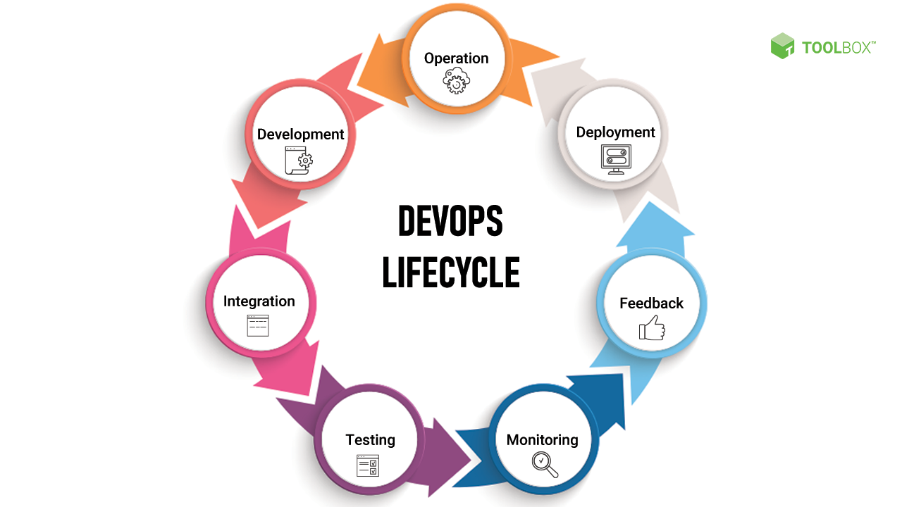

devops:
DevOps is a software development approach that aims to unify the development (Dev) and operations (Ops) teams in order to improve collaboration, communication, and efficiency in software development and deployment.

This an example of the devops lifecycle. 

DevOps benefits:
1. faster time-to-market for software releases
2. Improved collaboration and communication between teams
3. Increased agility and flexibility in responding to customer needs and market changes
4. Improved quality and reliability of software releases

The role entails.
It invloves bridging the gap between development and operations teams by implementing tools, processes, and automation that enable continuous integration and delivery of software.

DevOps engineers work with a very wide range of people. From stakeholders to dev teams to operations teams to quality assurance teams and virtually every business stakeholder. the teams also include: security teams, network teams, database administrators, and cloud service providers.

Common delverablies could include:
1. working on Infrastructure as code (IaC) scripts and templates
2. Continuous integration and delivery pipelines
3. Monitoring and logging systems
4. Automation scripts and tools
amongst many more

a day-to-day's responibility could include; 
1. Setting up and maintaining infrastructure and tools for testing, deployment, and monitoring
2. Troubleshooting and resolving issues related to software deployment and performance
3. Optimizing infrastructure and application performance and scalability

A DevOps engineer can provide significant value to an organization by enabling faster and more reliable software development and deployment. This all typically results in reduce costs. 

Software development lifecycle goes hand in hand with Devops engineers. they are responsible for implementing the tools and processes necessary to enable continuous integration and delivery. 

Progression. An engineer's career could progrss in the following way. 
1. DevOps engineer
2. DevOps team lead
3. DevOps architect
4. DevOps manager

Cloud computing.
Cloud computing is a model for delivering computing resources, such as servers, storage, and applications, over the internet. Cloud computing enables organizations to access these resources on-demand, without the need for on-premise infrastructure.

Amazon.
Amazon is a prime example of a company that has fully embraced DevOps practices. Amazon has implemented a fully automated software delivery pipeline that enables teams to quickly and reliably deploy code changes.

Netflix.
Netflix have implemented a highly automated software delivery pipeline that enables them to release new features and updates to their streaming service quickly and with minimal downtime. Netflix's DevOps practices have enabled them to stay ahead of their competitors

Etsy.
Etsy is an e-commerce website that has embraced DevOps practices to improve their software development and delivery processes. They have implemented a fully automated software delivery pipeline that enables them to release code changes quickly and with minimal downtime. 

[def]: DevOps-Lifecycle.png

CICD = Continous integrattion continous developmemt

the cloud = allows an online method for comapnies to implement new features, brings scalability

4 Pillars of DevOps: 
1. Ease of use: tools need to be user friendly, which reduces problems down the line
2. Flexibility: in an effort to keep up-to-date with the industry, everything the company uses should be easily changed/ updated
3. Robustness: tools need to have an uptime as close to 100% as possible, this is the responsibility for DevOps engineers 
4. Cost: the company needs to be as efficient as possible, which lowers the cost for the business

.png)